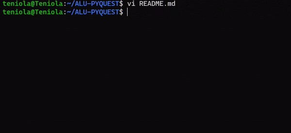

# AI Commit :robot: :speech_balloon:




AI Commit is a powerful command-line tool that streamlines your Git workflow by using OpenAI's GPT-3 language model to generate commit messages for your Git commits. Have you ever found yourself spending too much time thinking of the perfect commit message that accurately describes your changes? AI Commit eliminates that problem by providing you with a range of quality commit message options in just seconds, so you can spend more time coding and less time writing commit messages.

## Prerequisites :clipboard:

Before installing AI Commit, you will need to generate your OpenAI API key. If you haven't already done this, you can follow the steps in this [video tutorial](https://www.youtube.com/watch?v=nafDyRsVnXU) to get your key.

You will also need to have pip installed. To check if you have pip installed, open your terminal window and run the following command:
```sh
pip --version
```

If you see a version number in the output, it means that pip is installed. If not, you can install pip by running the following commands in your terminal:
```sh
sudo apt-get update
sudo apt-get install python3-pip
```

Verify that pip has been installed correctly by running:
```sh
pip --version
```

You should see something like:
```sh
user@User:~$ pip --version
pip 20.0.2 from /usr/lib/python3/dist-packages/pip (python 3.8)
user@User:~$
```
## Installation :inbox_tray:
To install AI Commit, please follow the steps below:
1. Clone the AI Commit repository to your local machine by running the following command in your terminal:
```sh
git clone https://github.com/Elhameed/aicommits.git
```
2. Navigate into the cloned repository by running the following command in your terminal:
```sh
cd aicommits
```
3. Run the install.sh script by running the following command in your terminal:
```sh
./install.sh
```
This will install the required Python packages, copy the AI Commit script to your /usr/local/bin directory, and add an alias to your .bashrc file.

Congratulations! You have successfully installed AI Commit on your machine.

## Usage :zap:
To use AI Commit, do the following:
1. Export your OpenAI API key as an environment variable by running:
```sh
export OPENAI_API_KEY="YOUR_API_KEY_HERE"
```
2. Navigate to the directory of the Git repository you wish to commit changes to, and run the following command in your terminal:
```sh
aicommit

```
This will prompt AI Commit to generate a commit message based on your changes. The generated message will be displayed, along with the option to either accept it (`y`), reject it and generate a new one (`n`), or edit it manually (`e`). If you choose to edit it manually, you will be prompted to enter your desired commit message.

**Note:** AI Commit generates one commit message at a time, with the option to generate more if the initial message is rejected.

## Uninstallation :outbox_tray:
To uninstall AI Commit, please follow the steps below:
1. Navigate to the directory where you cloned the AI Commit repository by running the following command in your terminal:
```sh
cd <path-to-aicommits-repo>
```
2. Run the uninstall.sh script by running the following command in your terminal:
```sh
./uninstall.sh
```
This will remove the AI Commit script from your `/usr/local/bin` directory, remove the alias from your `.bashrc` file, and uninstall the required Python packages.

Congratulations! You have successfully uninstalled AI Commit from your machine.

## Contribution :raised_hands:
I welcome contributions from the community! If you find a bug 🐛 or have an idea for a new feature 💡, please open an issue or submit a pull request.

## LICENSE :scroll:
AI Commit is licensed under the MIT License. See the [LICENSE](./LICENSE) file for more information.

## Acknowledgments :pray:
- AI Commit is powered by OpenAI's GPT-3 language model. We are grateful for their contributions to the field of artificial intelligence.
- I would like to give credit to the developers of [aicommits](https://github.com/Nutlope/aicommits), a similar tool that uses Node.js and npm. Their work inspired me to create AI Commit and I am grateful for the contributions they have made to the development community.


----------
- If you found AI Commit useful, please consider giving this repo a star ⭐️!

